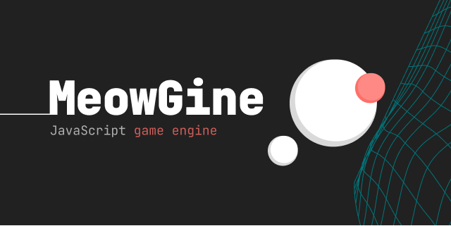

# 

Canvas-based game engine with relative scaling. Collision detection uses the [SAT.js](https://github.com/jriecken/sat-js) library.

## Classes

- [Utils](docs/utils.md);
- [Surface](docs/surface.md);
- [Entity](docs/entity.md):
  - Particle;
  - Sprite.
- [Background](docs/background.md);
- [Tilemap](docs/tilemap.md);
- [Camera](docs/camera.md);

## Getting Started

```js
(() => {
  "use strict";

  //--------------------------------------------------------------------------
  // Game objects declaration
  //--------------------------------------------------------------------------
  //
  // The game objects structure might look like this:
  //
  // Surface
  // |- Room 0
  //    |- Camera 0
  //    |- Layer 0
  //       |- Background 0
  //    |- Layer 1
  //       |- Tilemap 0
  //    |- Layer 2
  //       |- Tilemap 1
  //    |- Layer 3
  //       |- Entity 0
  //       |- Entity 1
  //       |- Entity 2
  // |- Room 1
  // ...
  //

  let surface = {};
  // `room[0]` - layer 0 for room.
  let room = [{ background: {}, entity: {} }];

  //--------------------------------------------------------------------------
  // Initialization
  //--------------------------------------------------------------------------

  const init = () => {
    // Surface
    //--------------------------------------------------------------------------

    //
    // Create a surface based on the canvas element with id "surface",
    // then set the aspect ratio of the canvas element to 16:9.
    //
    surface = new MG.Surface("#surface", 16, 9);

    // Turn off image smoothing if necessary.
    surface.ctx.imageSmoothingEnabled = false;

    // Layer 0
    //--------------------------------------------------------------------------

    room[0].background = new MG.Background({
      src: `${IMAGE_PATH}`,
      sW: 1920,
      sH: 1200,
      pos: surface.pos("mc"),
      dW: 192,
      dH: 120,
    });

    //
    // Convert `vmin` or `vmax` units to `px`.
    //
    // Specified in the surface instance as the last optional parameter.
    //
    room[0].background.u2p(surface);

    room[0].entity = new MG.Entity(
      "mc",
      new SAT.Circle(surface.pos("mc"), 5),
      new MG.Particle(),
      new MG.Sprite(),
      { name: "player" }
    );

    room[0].entity.u2p(surface);

    // Events
    //--------------------------------------------------------------------------

    window.onresize = () => {
      resizeThrottling(() => {
        //
        // 1. Before resize.
        //
        // Convert pixels back to units for recalculation
        // after resizing.
        //
        room[0].background.p2u(surface);
        room[0].entity.p2u(surface);

        // 2. Resize.
        surface.resize();

        // 3. After resize.
        room[0].background.u2p(surface);
        room[0].entity.u2p(surface);
      }, 500);
    };

    surface.el.addEventListener("mousemove", (e) => {
      // Smootly move entity position to mouse cursor position.
      MG.Utils.easePos(
        room[0].entity.collision.pos,
        new SAT.V(e.offsetX, e.offsetY),
        0.25
      );
    });

    // Run game loop.
    loop();
  };

  //--------------------------------------------------------------------------
  // Game loop
  //--------------------------------------------------------------------------

  const loop = (timeStamp) => {
    // Clear surface.
    surface.cls();

    // Layer 0
    //--------------------------------------------------------------------------

    // Render background.
    room[0].background.render(surface);

    // Render collision of entity.
    room[0].entity.render(surface, { hasFill: true });

    // Callback game loop.
    window.requestAnimationFrame(loop);
  };

  /** Resize event throttling function. */
  const resizeThrottling = (() => {
    let alarm = 0;
    return (f, ms) => {
      clearTimeout(alarm);
      alarm = setTimeout(f, ms);
    };
  })();

  // Run code on page load.
  window.onload = () => {
    init();
  };
})();
```
