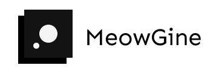

## What is it

Canvas based two-dimensional simplified physics engine with support utilities.

The structure consists of the following classes:

- [Viewbox](https://github.com/elsemeow/meowgine/wiki/Viewbox);
- [Particle](https://github.com/elsemeow/meowgine/wiki/Particle);
- [Utilities](https://github.com/elsemeow/meowgine/wiki/Utilities);
- [Sprite](https://github.com/elsemeow/meowgine/wiki/Sprite);
- [Circle](https://github.com/elsemeow/meowgine/wiki/Circle);
- [Rect](https://github.com/elsemeow/meowgine/wiki/Rect);
- [Line](https://github.com/elsemeow/meowgine/wiki/Line).

## Areas of application

- demo scenes;
- effects and animations;
- games;
- education.

---

Please, visit [wiki page](https://github.com/elsemeow/meowgine/wiki) for more information.
