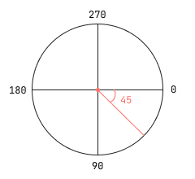
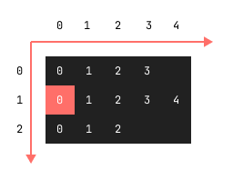

# Entity

A composite class to represent a game object.

_fig 1. Example of angle for `SAT.Polygon`, direction for `MG.Particle` or `angle` for `entity.sprite.render()` as last parameter._



## Example

```js
(() => {
  "use strict";

  let surface = {};
  let entity = {};

  const init = () => {
    surface = new MG.Surface("#surface", 16, 9);
    surface.ctx.imageSmoothingEnabled = false;

    entity = new MG.Entity(
      "bc",
      new SAT.Polygon(surface.pos("mc"), [
        new SAT.V(),
        new SAT.V(5, 0),
        new SAT.V(5, 10),
        new SAT.V(0, 10),
      ]),
      new MG.Particle(),
      new MG.Sprite({
        src: `${STRIPE_PATH}`,
        ix: 0,
        iy: 1,
        sW: 42,
        sH: 42,
        dW: 15,
        dH: 15,
        frames: 8,
        speed: 15,
      })
    );

    entity.u2p(surface);

    window.onresize = () => {
      resizeThrottling(() => {
        entity.p2u(surface);

        surface.resize();

        entity.u2p(surface);
      }, 500);
    };

    loop();
  };

  const loop = (timeStamp) => {
    surface.cls();

    entity.sprite.render(entity.collision, surface);
    entity.render(surface, { hasBorder: true }, { hasFill: true });

    window.requestAnimationFrame(loop);
  };

  const resizeThrottling = (() => {
    let alarm = 0;
    return (f, ms) => {
      clearTimeout(alarm);
      alarm = setTimeout(f, ms);
    };
  })();

  window.onload = () => {
    init();
  };
})();
```

## Parameters

```js
/**
 * @param {string} origin
 * @param {SAT.Circle|SAT.Polygon|SAT.Box} collision
 * @param {MG.Particle} particle
 * @param {MG.Sprite} sprite
 * @param {Object} vars
 */
```

_fig. 2 Possible values of origin._

```js
/**
 * (tl)-----(tc)-----(tr)
 *  |                  |
 *  |                  |
 * (ml)     (mc)     (mr)
 *  |                  |
 *  |                  |
 * (bl)-----(bc)-----(br)
 */
```

- `origin` - of collision, avaliable for `SAT.Polygon` only, if u wath to use `SAT.Circle` or `SAT.Box`, pass to this parameter empty string `""`, possible values (_fig. 2_):
  - `tl` - top left;
  - `tc` - top center;
  - `tr` - top right;
  - `ml` - middle left;
  - `mc` - middle center;
  - `mr` - middle right;
  - `bl` - bottom left;
  - `bc` - bottom center;
  - `br` - bottom right.
- `collision` - instance of `SAT.Circle`, `SAT.Polygon` or `SAT.Box`, all initial values should be in `units`, _more info about SAT.js avaliable [here](https://github.com/jriecken/sat-js)_;
- `particle` - instance of `MG.Particle` for entity (physics);
- `sprite` - instance of `MG.Sprite` for entity;
- `vars` - miscellaneous variables;

### MG.Particle

Point with physical properties.

```js
/**
 * @param {number} speed
 * @param {number} direction - in radians.
 * @param {Object} [options]
 * @param {number} [options.gravity]
 * @param {number} [options.mass]
 * @param {number} [options.bounce]
 * @param {number} [options.friction]
 */
```

#### Getters and setters

```js
/**
 * @param {number} speed
 */
entity.particle.speed = 0.01;

/**
 * @returns Speed.
 */
entity.particle.speed;
```

```js
/**
 * @param {number} direction - Direction in radians.
 */
entity.particle.direction = Math.PI / 3;

/**
 * @returns Direction in radians.
 */
entity.particle.direction;
```

#### Methods

```js
/**
 * @param {SAT.Vector} pos
 * @param {Surface} surface
 * @returns Updated particle coordinates in px, specified as a SAT.Vector.
 */
entity.particle.update(pos, surface);
```

```js
/**
 * @param {number} ax - Acceleration along x axis.
 * @param {number} ay - Acceleration along y axis.
 */
entity.particle.accelerate(ax, ay);
```

```js
/**
 * @param {Object} p
 * @param {number} p.x
 * @param {number} p.y
 * @returns Angle from particle to point in radians.
 */
entity.particle.angleTo(p);
```

```js
/**
 * @param {Object} p
 * @param {number} p.x
 * @param {number} p.y
 * @returns Distance from particle to point.
 */
entity.particle.distanceTo(p);
```

```js
/**
 * Create spring from particle to point.
 * @param {Object} p
 * @param {number} p.x
 * @param {number} p.y
 * @param {number} k - Factor of spring's stiffness.
 * @param {number} length
 */
entity.particle.addSpring(p, k, length);
```

```js
/**
 * Remove spring from particle to point.
 * @param {Object} p
 * @param {number} p.x
 * @param {number} p.y
 */
entity.particle.removeSpring(p);
```

```js
/**
 * Create gravitation between two particles.
 * @param {MG.Particle} particle
 */
entity.particle.addGravitation(particle);
```

```js
/**
 * Remove gravitation between two particles.
 * @param {MG.Particle} particle
 */
entity.particle.removeGravitation(particle);
```

### MG.Sprite

```js
/**
 * @param {Object} [options]
 * @param {Image} [options.img] - Instance of image (e.g. image from another sprite or tilemap instance).
 * @param {string} [options.src] - Path to source.
 * @param {number} [options.ix] - Horizontal index (fig. 3).
 * @param {number} [options.iy] - Vertical index (fig. 3).
 * @param {number} [options.sW] - Single frame source width (px).
 * @param {number} [options.sH] - Single frame source height (px).
 * @param {number} [options.dxS] - Horizontal origin shift for current frame (units).
 * @param {number} [options.dyS] - Vertical origin shift for current frame (units).
 * @param {number} [options.dW] - Width of current frame (units).
 * @param {number} [options.dH] - Height of current frame (units).
 * @param {number} [options.frames] - Number of frames for current stripe (`iy`).
 * @param {number} [options.speed] - Animation speed in frames per second (fps).
 */
```

_fig 3. Sprite stripes example._



#### Getters and setters

- `ixLast` - current sprite index;

#### Methods

```js
/**
 * @param {SAT.Circle|SAT.Polygon|SAT.Box} collision
 * @param {MG.Surface} surface
 * @param {number} [angle] - In radians, if collision have no it's own.
 */
entity.sprite.render(collision, surface, angle);
```

## Getters

Returns type of entity collision: `"circle"`, `"polygon"` or `"box"`.

```js
entity.type;
```

## Methods

Convert units to pixels after `surface.resize()` method or after a `entity` instance creating.

```js
/**
 * @param {MG.Surface} surface
 */
entity.u2p(surface);
```

Convert pixels to units before `surface.resize()` method.

```js
/**
 * @param {MG.Surface} surface
 */
entity.p2u(surface);
```

Synchronize the entity's particle position with the collision.

```js
/**
 * @param {MG.Surface} surface
 */
entity.syncPos(surface);
```

Render a `entity` collision on a `surface`.

This method can take optional parameter to display the stylized collision shape or origin (useful for debugging).

```js
/**
 * @param {MG.Surface} surface
 * @param {Object} [collision]
 * @param {boolean} [collision.hasFill]
 * @param {boolean} [collision.hasBorder]
 * @param {number} [collision.borderWidth]
 * @param {string} [collision.borderColor]
 * @param {string} [collision.fillColor]
 * @param {Object} [origin]
 * @param {boolean} [origin.hasFill]
 * @param {string} [origin.fillColor]
 * @param {number} [origin.r]
 */
entity.render(surface, collision, origin);
```
