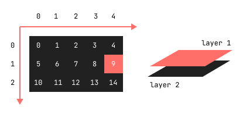

# Tilemap

A tilemap is a special kind of layer where each grid cell on the canvas is a reference to a tile (a little image) in its tileset.

_fig 1. Tile `{ x: 4, y: 1 }` selected on layer 1_



## Example

Let's create a level with one layer of tiles.

```js
(() => {
  "use strict";

  let surface = {};
  let tilemap = {};

  const init = () => {
    surface = new MG.Surface("#surface", 16, 9);
    surface.ctx.imageSmoothingEnabled = false;

    tilemap = new MG.Tilemap({
      src: `${TILESET_PATH}`,
      sR: 3,
      sC: 5,
      sW: 16,
      sH: 16,
      pos: surface.pos("tl"),
      dW: 10,
      dH: 10,
      rows: 2,
      cols: 3,
      tilemap: [
        { x: 0, y: 0 }, { x: 1, y: 2 }, { x: 0, y: 0 },
        { x: 0, y: 0 }, { x: 0, y: 0 }, { x: 4, y: 2 },
      ],
    });

    tilemap.u2p(surface);

    window.onresize = () => {
      resizeThrottling(() => {
        tilemap.p2u(surface);

        surface.resize();

        tilemap.u2p(surface);
      }, 500);
    };

    loop();
  };

  const loop = (timeStamp) => {
    surface.cls();

    tilemap.render(surface);

    window.requestAnimationFrame(loop);
  };

  const resizeThrottling = (() => {
    let alarm = 0;
    return (f, ms) => {
      clearTimeout(alarm);
      alarm = setTimeout(f, ms);
    };
  })();

  window.onload = () => {
    init();
  };
})();
```

## Parameters

```js
/**
   * @param {Object} [options]
   * @param {Image} [options.img]
   * @param {string} [options.src]
   * @param {number} [options.sR]
   * @param {number} [options.sC]
   * @param {number} [options.sW]
   * @param {number} [options.sH]
   * @param {SAT.Vector} [options.pos]
   * @param {number} [options.dW]
   * @param {number} [options.dH]
   * @param {number} [options.rows]
   * @param {number} [options.cols]
   * @param {Object[]} [options.tilemap]
   * @param {number} [options.tilemap.x]
   * @param {number} [options.tilemap.y]
   */
```

- `img` - instance of image (e.g. tileset from another tilemap instance);
- `src` - path to image (tileset), unnecessary if `img` passed;
- `sR` - rows in source tileset;
- `sC` - columns in source tileset;
- `sW` - source single tile width, in `px`;
- `sH` - source single tile height, in `px`;
- `pos` - tilemap start point, in `units`;
- `dW` - scaled single tile width, in `units`;
- `dH` - scaled single tile height, in `units`;
- `rows` - rows in tilemap;
- `cols` - columns in tilemap;
- `tilemap` - where each tile is represented as a column (`x`) and row (`y`) of the original tileset.

## Methods

Convert units to pixels after `surface.resize()` method or after a `tilemap` instance creating.

```js
/**
 * @param {MG.Surface} surface
 */
tilemap.u2p(surface);
```

Convert pixels to units before `surface.resize()` method.

```js
/**
 * @param {MG.Surface} surface
 */
tilemap.p2u(surface);
```

Render a `tilemap` on a `surface`.

```js
/**
 * @param {MG.Surface} surface
 */
tilemap.render(surface);
```
